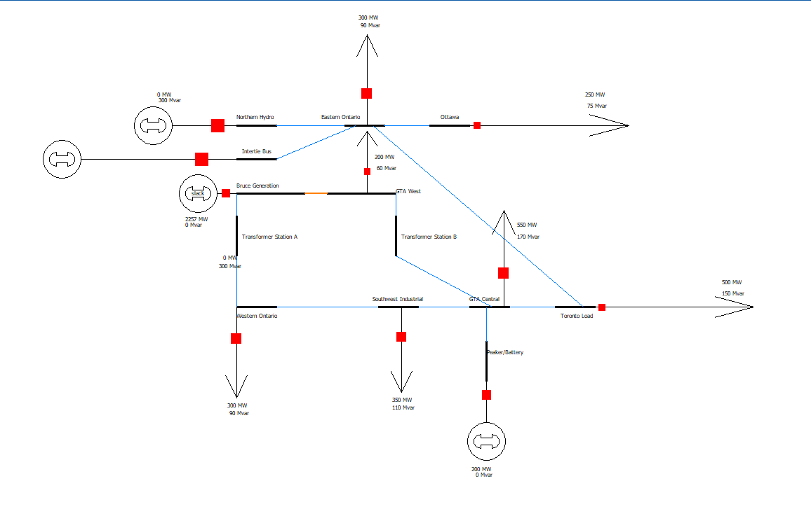
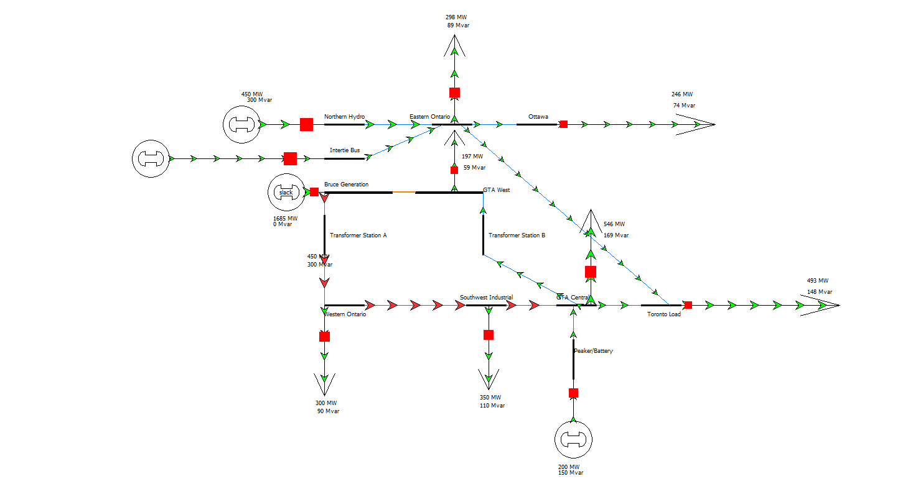
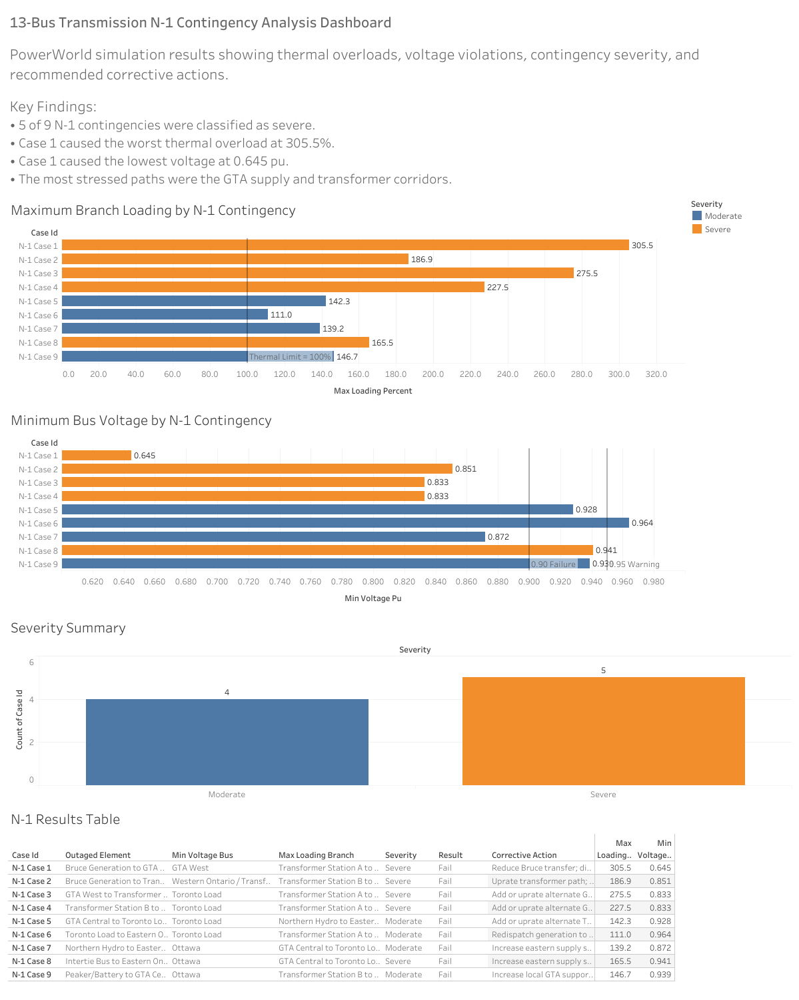
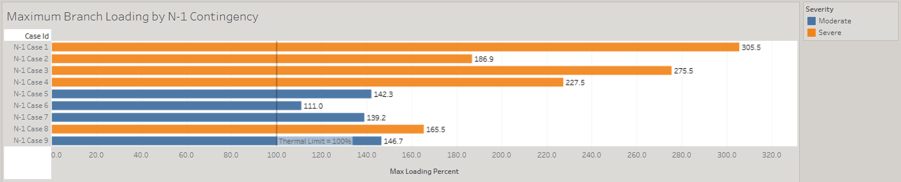
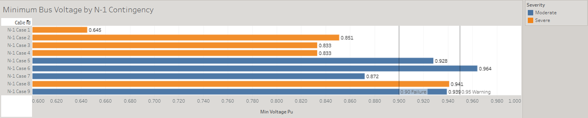
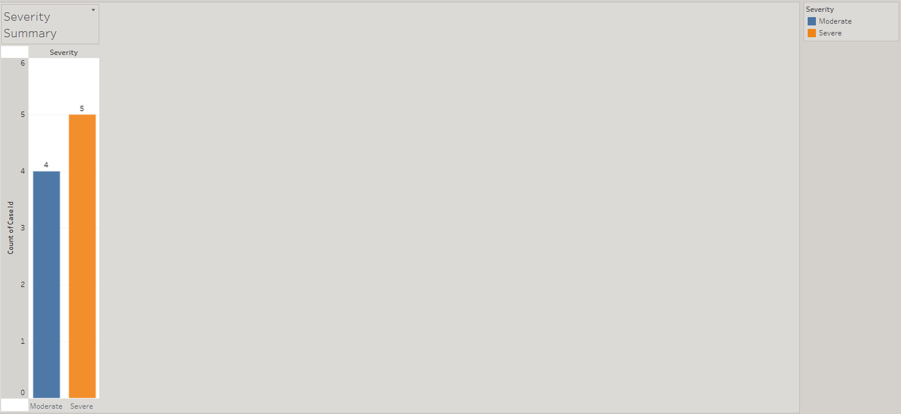

# 13-Bus Transmission N-1 Contingency Analysis

A mock utility-style power systems analysis project for a simplified Ontario-inspired 13-bus transmission network. The project simulates a complete N-1 contingency workflow: base case power flow modeling, systematic outage testing, violation identification, corrective action planning, and dashboard-based results communication.

## Project Overview

Built around PowerWorld Simulator and Tableau, the package documents a simplified 13-bus transmission network under N-1 contingency conditions, including base case power flow setup, nine individual branch outage tests, structured results tracking, corrective action recommendations, and technical reporting.

System workflow:

```text
PowerWorld model setup → Base case power flow solution → N-1 outage testing → Violation identification → Corrective action planning → CSV summary creation → Tableau dashboard visualization → Final report compiled
```

## Key Features

- Simplified 13-bus Ontario-inspired transmission network with 500 kV and 230 kV buses
- Base case Newton-Raphson power flow solution
- Nine individually tested N-1 contingency cases
- Voltage violation and thermal overload identification
- Severity classification (severe / moderate) for each contingency
- Corrective action recommendations tied to each violation
- Tableau dashboard summarizing loading, voltage, severity, and corrective actions
- Final LaTeX-compiled technical report

## Project Scenario

A simplified planning-style transmission network was modeled to test N-1 contingency workflow rather than to represent the real Ontario grid. The system includes generation sources, major load centers, transformer corridors, GTA-area transmission paths, an eastern support area, and a peaker/battery resource. After solving the base case, each of nine selected branches was opened individually while the rest of the system remained in service, and the resulting voltage and loading conditions were recorded.

| Item | Value |
|---|---|
| Network size | 13 buses |
| Voltage levels | 500 kV, 230 kV |
| Generation sources | Bruce Generation, Northern Hydro, Intertie Bus, Peaker/Battery |
| Major load centers | GTA Central, Toronto Load, Ottawa, Western Ontario, Southwest Industrial, Eastern Ontario |
| N-1 cases tested | 9 |
| Severe cases | 5 of 9 |
| Moderate cases | 4 of 9 |
| Worst case | N-1 Case 1, Bruce Generation to GTA West outage |

## Why This Project Was Built

This project was created to strengthen practical skills relevant to power system planning and control room roles, including:

- Power flow modeling using PowerWorld Simulator
- Newton-Raphson power flow solution methods
- N-1 contingency analysis and outage testing
- Voltage violation and thermal overload identification
- Severity classification and engineering judgment
- Corrective action planning
- Structured results tracking in CSV format
- Tableau dashboard development
- Technical report preparation

## Tools Used

| Tool | Function |
|---|---|
| PowerWorld Simulator | Transmission system modeling, base case power flow, N-1 contingency testing |
| Microsoft Excel / CSV | Contingency results tracking and corrective action summary |
| Tableau Public | Dashboard visualization for loading, voltage, severity, and corrective actions |
| LaTeX | Final technical report compilation |

## System Description

The modeled system is a simplified 13-bus transmission network inspired by Ontario-style generation, load, and transfer areas. It is not intended to represent the real Ontario grid exactly. Instead, it is designed as a planning-style test system for contingency analysis.

| Bus | Role |
|---|---|
| Bruce Generation | Major generation source |
| Northern Hydro | Generation source |
| Intertie Bus | Interconnection / generation support |
| Peaker/Battery | Local fast-response support |
| Western Ontario | Transfer bus |
| GTA West | Transfer bus |
| GTA Central | Major load center |
| Toronto Load | Major load center |
| Eastern Ontario | Transfer bus |
| Ottawa | Load center |
| Southwest Industrial | Load center |
| Transformer Station A | Transformer corridor |
| Transformer Station B | Transformer corridor |

## Base Case Power Flow



[Download full-resolution PowerWorld model](powerworld/13_bus_base_case.pwb)

The base case was solved using Newton-Raphson power flow and used as the reference operating condition for all nine N-1 outage cases.

## N-1 Contingency Results

| Case | Outaged Element | Min Voltage Bus | Min Voltage (pu) | Max Loading Branch | Max Loading (%) | Severity |
|---|---|---:|---:|---|---:|---|
| N-1 Case 1 | Bruce Generation to GTA West | GTA West | 0.645 | Transformer Station A to Western Ontario | 305.5 | Severe |
| N-1 Case 2 | Bruce Generation to Transformer Station A | Western Ontario / Transformer Station A | 0.851 | Transformer Station B to GTA Central | 186.9 | Severe |
| N-1 Case 3 | GTA West to Transformer Station B | Toronto Load | 0.833 | Transformer Station A to Western Ontario | 275.5 | Severe |
| N-1 Case 4 | Transformer Station B to GTA Central | Toronto Load | 0.833 | Transformer Station A to Western Ontario | 227.5 | Severe |
| N-1 Case 5 | GTA Central to Toronto Load | Toronto Load | 0.928 | Northern Hydro to Eastern Ontario | 142.3 | Moderate |
| N-1 Case 6 | Toronto Load to Eastern Ontario | Toronto Load | 0.964 | Transformer Station A to Western Ontario | 111.0 | Moderate |
| N-1 Case 7 | Northern Hydro to Eastern Ontario | Ottawa | 0.872 | GTA Central to Toronto Load | 139.2 | Moderate |
| N-1 Case 8 | Intertie Bus to Eastern Ontario | Ottawa | 0.941 | GTA Central to Toronto Load | 165.5 | Severe |
| N-1 Case 9 | Peaker/Battery to GTA Central | Ottawa | 0.939 | Transformer Station B to GTA Central | 146.7 | Moderate |

### N-1 Case 1 Result (Worst Case)



[Download full-resolution PDF report](report/13_Bus_Transmission_N_1_Contingency_Analysis_Report.pdf)

## Corrective Action Summary

| Case | Main Issue | Recommended Corrective Action |
|---|---|---|
| N-1 Case 1 | Severe undervoltage and major overloads | Reduce Bruce transfer, dispatch local GTA/eastern support, and add or uprate an alternate GTA supply path. |
| N-1 Case 2 | Undervoltage and transformer overload | Uprate transformer path and increase local support near Western Ontario/GTA Central. |
| N-1 Case 3 | Severe undervoltage and transformer overload | Add or uprate an alternate GTA supply path and reduce transfer through Station A. |
| N-1 Case 4 | Undervoltage across GTA/eastern buses | Add or uprate an alternate GTA Central supply path and reinforce Station A/Western corridor. |
| N-1 Case 5 | Voltage warning at Toronto Load | Add or uprate an alternate Toronto supply path and increase local voltage support. |
| N-1 Case 6 | Moderate transformer overload | Redispatch generation to reduce western transfer and monitor transformer loading. |
| N-1 Case 7 | Undervoltage in eastern buses | Increase eastern supply support and dispatch intertie or peaker support. |
| N-1 Case 8 | Voltage warning and GTA overloads | Increase eastern support, reduce GTA/Toronto transfer stress, and uprate Toronto supply path. |
| N-1 Case 9 | Loss of local GTA support | Dispatch replacement local support near GTA Central and reinforce Transformer Station B to GTA Central path. |

## Tableau Dashboard

**Live interactive dashboard:** [View on Tableau Public](https://public.tableau.com/views/13-BusTransmissionN-1ContingencyAnalysis-Draft/Dashboard1?:language=en-US&:sid=&:redirect=auth&:display_count=n&:origin=viz_share_link)

Static exports located in:

```text
tableau/dashboard_overview.png
```

Summarizes the N-1 results using maximum branch loading by contingency case, minimum bus voltage by contingency case, a severity breakdown, and a full results table with corrective actions.



### Maximum Branch Loading by Case



### Minimum Bus Voltage by Case



### Severity Summary



## Problems Encountered

Several modeling and documentation issues came up during development:

- Debugging the base case until Newton-Raphson power flow converged cleanly before any contingency testing could begin
- Keeping outaged element names, bus names, and branch names consistent across the PowerWorld screenshots, CSV summary, and Tableau dashboard
- Distinguishing severe from moderate cases using a consistent voltage and loading threshold rather than a subjective read of each case
- Aligning the corrective action wording with the specific violation observed in each case, rather than reusing generic language across cases
- Sizing and cropping the Tableau dashboard exports so they rendered cleanly in the final LaTeX report without excess white space

These were resolved through iterative base case debugging, cross-checking the CSV summary against each PowerWorld screenshot, and applying a fixed severity threshold across all nine cases.

## Limitations

This project uses a simplified 13-bus educational model and does not represent the full Ontario transmission system. The analysis does not include:

- Dynamic stability
- Short-circuit analysis
- Protection coordination
- Economic dispatch
- Full reactive power planning
- Actual utility planning data

The purpose of the project is to demonstrate transmission planning workflow, N-1 contingency evaluation, engineering interpretation, corrective action planning, and dashboard-based communication.

## Future Improvements

- Full reactive power and voltage support study incorporating capacitor banks, SVCs, or generator reactive limits
- N-2 or common-mode contingency testing for more severe multi-element outages
- Live-linked Tableau workbook that updates automatically as new PowerWorld cases are exported
- Corrective action table tied to estimated reinforcement costs for a basic cost-benefit comparison
- Additional case studies (generator outages, transformer-specific contingencies)

## Folder Structure

```text
powerworld-n1-contingency-tableau/
│
├── README.md
│
├── data/
│   ├── n1_summary_results_formatted.csv
│   └── corrective_actions_sheet.xlsx
│
├── powerworld/
│   ├── 13_bus_base_case.pwb
│   └── 13_bus_base_case.pwd
│
├── screenshots/
│   ├── base-case-oneline.png
│   ├── n1_case_01_bruce_to_gta_west_outage.png
│   ├── n1_case_02_bruce_to_transformer_station_a_outage.png
│   ├── n1_case_03_gta_west_to_transformer_station_b_outage.png
│   ├── n1_case_04_transformer_station_b_to_gta_central_outage.png
│   ├── n1_case_05_gta_central_to_toronto_load_outage.png
│   ├── n1_case_06_toronto_load_to_eastern_ontario_outage.png
│   ├── n1_case_07_northern_hydro_to_eastern_ontario_outage.png
│   ├── n1_case_08_intertie_bus_to_eastern_ontario_outage.png
│   └── n1_case_09_peaker_battery_to_gta_central_outage.png
│
├── tableau/
│   ├── dashboard_overview.png
│   ├── max_loading_by_case.png
│   ├── min_voltage_by_case.png
│   └── severity_summary.png
│
└── report/
    └── 13_Bus_Transmission_N_1_Contingency_Analysis_Report.pdf
```

## Final Report

The complete technical report for this project is included in:

```text
report/13_Bus_Transmission_N_1_Contingency_Analysis_Report.pdf
```

## Skills Demonstrated

- Power flow modeling in PowerWorld Simulator
- Newton-Raphson power flow solution
- N-1 contingency analysis
- Branch thermal overload identification
- Bus voltage violation analysis
- Severity classification and engineering judgment
- Corrective action planning
- CSV-based results tracking
- Tableau dashboard development
- Power systems engineering communication

## Disclaimer

This project is a fictional engineering portfolio project created for educational purposes only. It is not based on any confidential utility information, real transmission planning data, or internal design standards. All bus names, topology, loading values, and results are intended solely to demonstrate power systems analysis and engineering communication workflows.

## Author

**Vivek Aruja**
Electrical Engineering + AI Systems Engineering
Western University